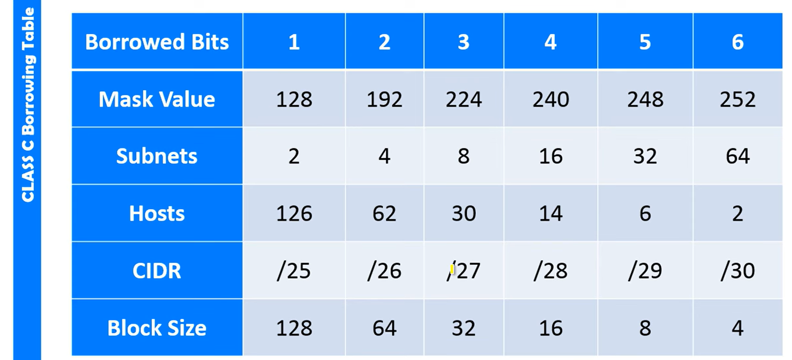

### All time important needs:

---

* **IP Address** → Your device’s unique ID in a network.
* **Subnet Mask** → Splits IP into **network part** + **host part**.
* **Gateway** → The device (usually router) that connects your network to **other networks (like the internet)**.

---

### 🧩 Example:

```
IP Address:   192.168.1.10
Subnet Mask:  255.255.255.0
Gateway:      192.168.1.1
```

👉 Here:

* **Network ID** = 192.168.1.0
* **Host ID** = 10
* **Gateway (192.168.1.1)** is used to reach outside networks.

---

**In short:**

> IP = device address
> Mask = tells what’s network/host part
> Gateway = exit door to other networks

---

1. **4 Octets**

   * An IPv4 address (like `192.168.100.225`) has **4 numbers** separated by dots.
   * Each number is called an **octet**.
   * Example:

     * `192` → 1st octet
     * `168` → 2nd octet
     * `100` → 3rd octet
     * `225` → 4th octet

---

2. **5 Classes**

   * IP addresses are divided into **classes** (A, B, C, D, E).

   * This is an old method of categorizing networks:

     | Class | Range (1st Octet) | Example IP  | Usage                      |
     | ----- | ----------------- | ----------- | -------------------------- |
     | A     | 1 – 126           | 10.x.x.x    | Very large networks        |
     | B     | 128 – 191         | 172.16.x.x  | Medium networks            |
     | C     | 192 – 223         | 192.168.x.x | Small networks (your case) |
     | D     | 224 – 239         | 224.x.x.x   | Multicasting               |
     | E     | 240 – 255         | 248.x.x.x   | Experimental               |

   * **Your IP (192.168.100.225)** = **Class C** (private network).

---

3. **0–255**

   * Each octet can go from **0 to 255** (because 1 octet = 8 bits, and 2⁸ = 256 values).
   * So IP ranges look like: `192.168.0.0` → `192.168.0.255`.

---

4. **32 bits**

   * IPv4 address length = **32 binary digits (bits)**.
   * Example:
     `192.168.100.225` in binary =
     `11000000.10101000.01100100.11100001` (32 bits).

---

✅ **CIDR (Classless Inter-Domain Routing):**
It’s a **modern way** to write IP + subnet mask in **short form**.

---

### 🧩 Example:

```
192.168.1.10/24
```

Here, **/24** = CIDR notation.
It means **first 24 bits** are **network bits**, remaining (32–24=8) are **host bits**.

---

### 🧮 How it’s calculated:

Each “255” in subnet mask = 8 bits.
So:

| Subnet Mask   | CIDR | Meaning |
| ------------- | ---- | ------- |
| 255.0.0.0     | /8   | Class A |
| 255.255.0.0   | /16  | Class B |
| 255.255.255.0 | /24  | Class C |

---

🧠 **In short:**

> CIDR = number of network bits in IP mask
> Example: 255.255.255.0 → /24


✅ **Usable host calculation (very short):**

Formula:

> 🧮 **Usable hosts = (2ⁿ – 2)**
> where **n = number of host bits** (bits left after network bits).
> We subtract 2 for **network** and **broadcast** addresses.

---

### 🧩 Example:

`192.168.1.0/24` → 32 – 24 = **8 host bits**
→ (2⁸ – 2) = **254 usable hosts**


---
---
---

# 🔹 1. The Borrowing (Subnetting) Table

Here’s a **basic Class C (/24)** example (256 total IPs).



| Borrowed Bits | New Prefix | Subnets  | Hosts  |
| ------------- | ---------- | -------- | ------ |
| 0             | /24        | 1        | 254    |
| 1             | /25        | 2        | 126    |
| 2             | /26        | 4        | 62     |
| 3             | /27        | 8        | 30     |
| 4             | /28        | 16       | 14     |
| 5             | /29        | 32       | 6      |
| 6             | /30        | 64       | 2      |

📌 Notice:

* More borrowed bits → more subnets.
* But fewer hosts per subnet.

---

# 🔹 2. Real-World Example

Suppose you own `192.168.1.0/24` (256 IPs).

* You need **4 subnets**.

👉 Look at the table:

* Borrow **2 bits** → /26
* That gives **4 subnets**, each with 62 hosts.

Resulting networks:

* `192.168.1.0 – 192.168.1.63`
* `192.168.1.64 – 192.168.1.127`
* `192.168.1.128 – 192.168.1.191`
* `192.168.1.192 – 192.168.1.255`

Now you’ve got 4 neat networks instead of one giant mess.


---
---
---
---


## After completing this document go to the day-1/10_subnettingQuestion.md for understand the initial concept