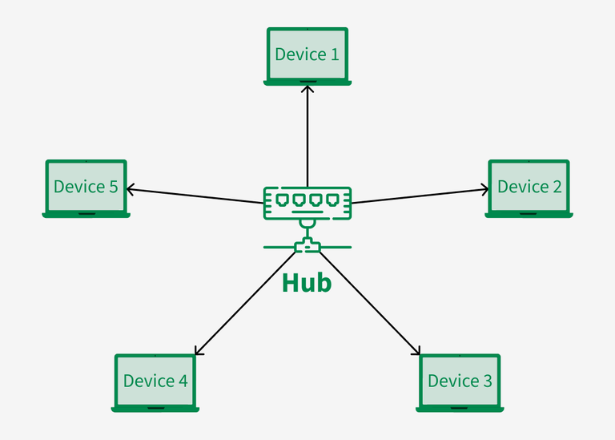
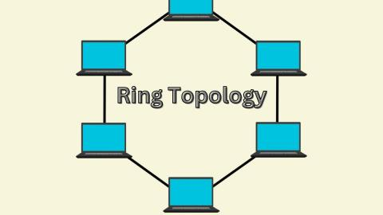
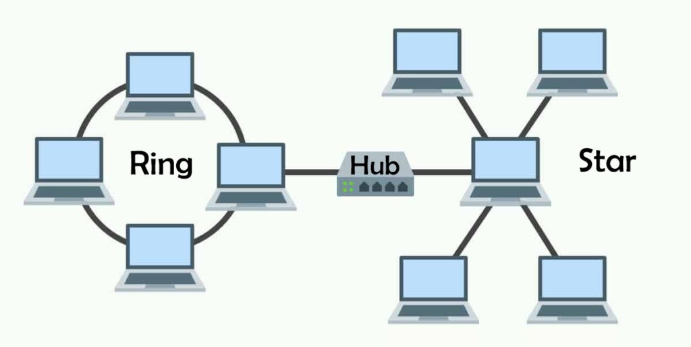

## 🌐 What is Network Topology?

**Definition:**
👉 Network topology is the **arrangement or layout of devices (nodes)** and the **connections (links)** between them in a network.
It describes **how data flows** between computers and other devices.

---

### 🧭 Types of Topologies (Broadly divided)

1. **Physical Topology** → actual physical connections (cables, devices).
2. **Logical Topology** → how data flows logically between nodes, regardless of physical layout.

---

## 📘 Main Types of Network Topologies

Let’s go one by one with clear diagrams and examples.

---

## 1️⃣ **Bus Topology**

### 🧩 Structure:

All devices are connected to a **single central communication line** (called a **bus** or **backbone**).


```
[PC1]──┬──[PC2]──┬──[PC3]──┬──[Printer]
        │          │          │
       (Single main cable = BUS)
```

### ⚙️ Working:

* Only **one device transmits** at a time.
* The signal travels in both directions on the bus.
* Each device checks if the message is for it.

### ✅ Advantages:

* Simple and inexpensive to install (less cabling).
* Good for small networks.
* Easy to extend by adding new devices to the main cable.

### ❌ Disadvantages:

* If the **main cable fails**, the entire network goes down.
* **Collisions** occur when multiple devices send data at once.
* Difficult to troubleshoot.
* Slower with more devices (shared medium).

### 🧠 Use case:

* Early **Ethernet (10BASE2, 10BASE5)** networks used bus topology.
* Small temporary networks or test labs.

---

## 2️⃣ **Star Topology**

### 🧩 Structure:

All devices are connected to a **central hub or switch**.




```
         [PC1]
           │
[PC2]───(SWITCH/Hub)───[PC3]
           │
         [Printer]
```

### ⚙️ Working:

* Each device has a **dedicated connection** to the central hub/switch.
* Hub → broadcasts data to all nodes.
* Switch → sends data only to the intended device (smarter).

### ✅ Advantages:

* **Easy to set up, manage, and troubleshoot**.
* If one link fails → others remain unaffected.
* **High performance** due to dedicated links.
* Scalable — easy to add/remove nodes.

### ❌ Disadvantages:

* If the **hub/switch fails**, the entire network stops.
* Requires more cables → slightly higher cost.

### 🧠 Use case:

* **Most common topology** in modern Ethernet LANs.
* Used in offices, schools, homes, etc.

---

## 3️⃣ **Ring Topology**

*(You didn’t list it, but it’s still important for completeness)*

### 🧩 Structure:

Each device is connected to exactly **two other devices**, forming a closed loop (ring).



```
[PC1]──[PC2]──[PC3]──[PC4]
  ↑                      ↓
  └──────────────────────┘
```

### ⚙️ Working:

* Data travels in one direction (or both, in dual ring).
* Each device passes the data to the next until it reaches the destination.

### ✅ Advantages:

* Predictable data flow (no collisions).
* Good performance for small, uniform loads.

### ❌ Disadvantages:

* If one device/cable fails → entire network may break.
* Difficult to troubleshoot.
* Adding/removing nodes disrupts the ring.

### 🧠 Use case:

* Used in **FDDI**, **Token Ring** (IBM), and **SONET** optical networks.

---

## 4️⃣ **Mesh Topology**

### 🧩 Structure:

Every device is connected **to every other device**.


```
[PC1]─────┬─────[PC2]
  │      ╱│╲      │
  │    ╱  │  ╲    │
[PC3]─────┴─────[PC4]
```

### ⚙️ Working:

* Multiple **paths exist** between devices.
* Data can travel via different routes → high reliability.

### 🧩 Two Types:

1. **Full Mesh:** every node connected to every other node.

   * For *n* devices → number of connections = `n(n-1)/2`
2. **Partial Mesh:** only some nodes are interconnected.

### ✅ Advantages:

* **Fault tolerant** (if one link fails, others work).
* **High reliability and security**.
* Best performance for mission-critical networks.

### ❌ Disadvantages:

* **Very costly** (requires lots of cabling and ports).
* **Complex to set up and manage**.
* Not practical for large networks.

### 🧠 Use case:

* **WANs**, **backbone networks**, **military**, **IoT sensor networks**, **data centers** (partial mesh).

---

## 5️⃣ **Tree (Hierarchical) Topology**

*(Often considered a mix of Star + Bus)*

### 🧩 Structure:

Central root node connects to lower-level nodes in a hierarchy.


```
          [Main Switch]
           /     |     \
     [Hub1]   [Hub2]   [Hub3]
      / \       |       / \
  [PC1][PC2]  [PC3]  [PC4][PC5]
```

### ✅ Advantages:

* Scalable, easy to expand.
* Good structure for large organizations.
* Fault isolation — lower segments can fail without total failure.

### ❌ Disadvantages:

* If root or backbone fails → multiple branches affected.
* Complex wiring compared to simple star.

### 🧠 Use case:

* Used in **large LANs**, **corporate networks**, and **campuses**.

---

## 6️⃣ **Hybrid Topology**

### 🧩 Structure:

Combination of **two or more topologies** (e.g., Star + Bus, Star + Ring).




```
     [Main Switch]
       /     \
   (Star)   (Bus)
   / | \     | \
 [A][B][C] [D][E]
```

### ✅ Advantages:

* **Flexible and scalable.**
* Can take the **best features** of multiple topologies.
* Easier to expand or modify sections independently.

### ❌ Disadvantages:

* **Expensive and complex** to design.
* Troubleshooting can be harder due to mixed architecture.

### 🧠 Use case:

* **Modern enterprise networks**, **data centers**, and **university networks** often use hybrid designs.

---

## 7️⃣ **Hub-Based Topology (Star Variant)**

*(Clarification since you mentioned Hub separately)*
A **Hub Topology** is essentially a **Star topology** where the central device is a **Hub** instead of a **Switch**.

| Feature       | Hub (Star)                 | Switch (Star)             |
| ------------- | -------------------------- | ------------------------- |
| Data handling | Broadcasts to all ports    | Sends only to destination |
| OSI Layer     | Physical (Layer 1)         | Data Link (Layer 2)       |
| Efficiency    | Low (collisions)           | High                      |
| Use           | Very small or old networks | Modern LANs               |

So when you select “**Hub topology**” — it’s basically the same **structure** as Star, but **simpler and dumber** electrically.

---

## 🔢 Comparison Summary Table

| Topology   | Cost      | Reliability | Cable Length | Scalability | Fault Isolation | Example       |
| ---------- | --------- | ----------- | ------------ | ----------- | --------------- | ------------- |
| **Bus**    | Low       | Low         | Short        | Poor        | Difficult       | Early LANs    |
| **Star**   | Moderate  | High        | Medium       | Good        | Easy            | Office LANs   |
| **Ring**   | Moderate  | Medium      | Medium       | Poor        | Difficult       | Token Ring    |
| **Mesh**   | Very High | Very High   | Very Long    | Poor        | Excellent       | Backbone, WAN |
| **Tree**   | High      | Medium      | Long         | Good        | Medium          | Universities  |
| **Hybrid** | High      | Very High   | Variable     | Excellent   | Hard            | Enterprises   |

---

## 🧠 Quick Trick to Remember

> 💡 **Star → Central device**
> 💡 **Bus → One main cable**
> 💡 **Ring → Circular path**
> 💡 **Mesh → All-to-all**
> 💡 **Tree → Star of stars**
> 💡 **Hybrid → Combination**

---

## 🏢 Real-World Examples

| Scenario                         | Topology Used           |
| -------------------------------- | ----------------------- |
| Home Wi-Fi with router           | Star (Router at center) |
| Old Ethernet lab setup           | Bus                     |
| Office LAN with switches         | Star or Tree            |
| Internet backbone                | Partial Mesh            |
| Campus with multiple departments | Hybrid (Star + Bus)     |


---
---
---


<br>
<br>
<br>


## 🧩 1️⃣ **Bus Topology**

### 🔹 Structure:

All computers are connected to a **single main cable** called the **backbone** or **bus**.

```
PC1 ---- PC2 ---- PC3 ---- PC4
          |
       (Main cable)
```

### 🔹 Number of Cables:

* **1 main cable** (the bus)
* So total cables = **1**

### 🔹 Number of Ports per device:

* Each device uses **1 port** to connect to the main bus cable.

### 🔹 Example:

* Small home network or older LANs.

### 🔹 Advantages:

* Easy to install and cost-effective (less cabling)
* Good for small networks

### 🔹 Disadvantages:

* If the main cable fails → entire network goes down
* Performance drops with more devices (signal collision)

---

## 🧩 2️⃣ **Star Topology**

### 🔹 Structure:

All devices are connected to a **central hub or switch**.

```
         PC1
          |
PC2 ---- HUB/SWITCH ---- PC3
          |
         PC4
```

### 🔹 Number of Cables:

* Each device requires **1 cable** to connect to the hub.
* If there are **N devices**, cables = **N**

### 🔹 Number of Ports:

* The hub/switch must have **N ports** (1 per device).
* Each computer uses **1 network port**.

### 🔹 Example:

* Most modern LANs use Star Topology with switches.

### 🔹 Advantages:

* Easy to set up and troubleshoot
* Failure of one cable/device doesn’t affect others

### 🔹 Disadvantages:

* If the **hub/switch fails**, the entire network fails
* Requires more cable length than Bus

---

## 🧩 3️⃣ **Ring Topology**

### 🔹 Structure:

Each device is connected to exactly **two other devices**, forming a **ring**.

```
PC1 --- PC2 --- PC3 --- PC4
 |                       |
  -----------(Back to PC1)
```

### 🔹 Number of Cables:

* **Number of cables = Number of devices (N)**
  because each device connects to 2 others (shared cables).

### 🔹 Number of Ports:

* Each device needs **2 ports** (one input and one output).

### 🔹 Example:

* Token Ring network, older MAN networks.

### 🔹 Advantages:

* Easy to install
* Data flows in one direction, reducing collisions

### 🔹 Disadvantages:

* Failure in any cable or device breaks the loop (entire network fails)
* Difficult to reconfigure

---

## 🧩 4️⃣ **Mesh Topology**

### 🔹 Structure:

Every device is connected **directly to every other device**.

```
For 4 devices:
PC1 --- PC2
 |  \    |
 |   \   |
PC3 --- PC4
```

### 🔹 Number of Cables:

* **For full mesh:**
  $$
  \text{Number of cables} = \frac{N(N-1)}{2}
  $$
  where **N = number of devices**

  🔸 Example: If N = 4
  ⇒ (4×3)/2 = **6 cables**

### 🔹 Number of Ports:

* Each device needs **(N–1)** ports
  because it connects to all others.

  🔸 Example: N = 4 ⇒ each device = 3 ports

### 🔹 Example:

* Used in military networks, banking systems (high reliability needed)

### 🔹 Advantages:

* Fault tolerant (if one link fails, data takes another route)
* Excellent reliability and security

### 🔹 Disadvantages:

* Very expensive (too many cables)
* Complex to install and manage

---

## 🧩 5️⃣ **Hybrid Topology**

### 🔹 Structure:

Combination of two or more topologies, e.g. **Star + Bus**, or **Star + Mesh**.

```
      [Star Network 1]        [Star Network 2]
PC1--Hub1--PC2--PC3--- Backbone ---Hub2--PC4--PC5
```

### 🔹 Number of Cables and Ports:

* Depends on which topologies are combined.
  For example:

  * If Star + Bus → cables = (N1 + N2) + 1 main bus
  * Ports = based on hubs and device connections.

### 🔹 Example:

* Used in large organizations or campuses (departments use Star; connected via Bus backbone)

### 🔹 Advantages:

* Flexible and scalable
* Combines strengths of multiple topologies

### 🔹 Disadvantages:

* More complex design
* Costly setup depending on scale

---

## 🧮 Quick Comparison Table

| **Topology** | **No. of Cables** | **Ports per Device** |         **Main Device Needed** | **Reliability** |  **Cost** |
| ------------ | ----------------: | -------------------: | -----------------------------: | --------------: | --------: |
| **Bus**      |      1 main cable |                    1 |           Terminator (at ends) |             Low |  Very Low |
| **Star**     |                 N |                    1 |                     Hub/Switch |          Medium |    Medium |
| **Ring**     |                 N |                    2 |                           None |          Medium |    Medium |
| **Mesh**     |          N(N–1)/2 |                  N–1 |                           None |       Very High | Very High |
| **Hybrid**   | Depends on design |              Depends | May use multiple hubs/switches |            High |      High |
