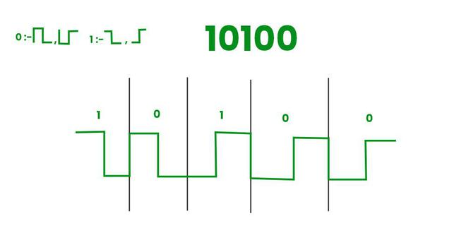

Excellent — this is a very important concept from the **Physical Layer** of computer networks 🔌
Let’s break it down **from zero**, so you understand **Manchester Encoding** and **Differential Manchester Encoding** deeply — including **how they work, how the signals look, their rules, and differences**.

---

# 🧠 What is Encoding?

When data (0s and 1s) is transmitted over a physical medium (like copper wire or fiber),
it cannot travel as "0" or "1" directly — it must be converted into **electrical or optical signals**.

👉 **Encoding** = the method of representing digital bits (0s and 1s) using voltage changes over time.

---

# ⚡ 1️⃣ **Manchester Encoding**


### 🧩 Basic Idea:

Each bit (0 or 1) is represented by **a transition (change) in the middle** of the bit period.

* That means: every bit time has **two halves**:

  * First half: one voltage level
  * Second half: opposite voltage level

### 🧭 Rules (IEEE 802.3 Standard – used in Ethernet):

| Bit   | Encoding Rule                          | Example Signal |
| ----- | -------------------------------------- | -------------- |
| **0** | High → Low transition in middle of bit | 🔼🔽           |
| **1** | Low → High transition in middle of bit | 🔽🔼           |

✅ The **transition in the middle** provides **synchronization** — so sender and receiver always stay in sync.

---

### 🧠 Think of it like this:

If we divide each bit into two halves:

```
|<---- bit period ---->|
| first half | second half |
```

Then:

* Bit **0** = HIGH then LOW
* Bit **1** = LOW then HIGH

---

### 📉 Example Signal:

Let’s encode **bit stream: 1 0 1 1 0**

| Bit | Manchester Encoding (H = High, L = Low) |
| --- | --------------------------------------- |
| 1   | L → H                                   |
| 0   | H → L                                   |
| 1   | L → H                                   |
| 1   | L → H                                   |
| 0   | H → L                                   |

So signal looks like:

```
L-H | H-L | L-H | L-H | H-L
```

Each vertical line (→) is a **mid-bit transition** that keeps synchronization.

---

### ⚙️ Advantages:

✅ Synchronization — every bit has a transition
✅ Easy error detection (missing transitions show errors)
✅ No DC component (balanced signal)

### ❌ Disadvantages:

❌ Bandwidth requirement is **double** the data rate (because two level changes per bit)

---

# ⚡ 2️⃣ **Differential Manchester Encoding**





### 🧩 Basic Idea:

Instead of using voltage levels to represent bits directly,
**it uses the presence or absence of a transition at the start of the bit** to define 0 and 1.

There’s **always a transition in the middle** of every bit (for clock synchronization).

---

### 🧭 Rules (used in IEEE 802.5 Token Ring):

| Bit        | Rule                                                      |
| ---------- | --------------------------------------------------------- |
| **0**      | Transition **at the start** of bit period                 |
| **1**      | **No transition** at start of bit period                  |
| **(Both)** | Always a transition in the **middle** for synchronization |

---

### 🧠 Explanation:

* Middle transition → for clock synchronization (like Manchester)
* Start transition → carries the data meaning (0 or 1)

---

### 📉 Example Signal:

Let’s encode **bit stream: 1 0 1 1 0**

| Bit | Start Transition? | Mid Transition (always) |
| --- | ----------------- | ----------------------- |
| 1   | No                | Yes                     |
| 0   | Yes               | Yes                     |
| 1   | No                | Yes                     |
| 1   | No                | Yes                     |
| 0   | Yes               | Yes                     |

So, the signal will **flip at mid-bit always**, and **sometimes at start** depending on bit value.

---

### ⚙️ Advantages:

✅ More **noise resistant** — depends on transitions, not absolute voltage levels
✅ **Differential** means it doesn’t matter if signal is inverted (less prone to polarity errors)
✅ Self-clocking (transition every bit)

### ❌ Disadvantages:

❌ Also uses **double bandwidth** like Manchester
❌ Slightly more complex encoding/decoding logic

---

# 🧮 Comparison Table

| Feature                  | Manchester                            | Differential Manchester                             |
| ------------------------ | ------------------------------------- | --------------------------------------------------- |
| **Bit representation**   | 0 = High→Low, 1 = Low→High            | 0 = Transition at start, 1 = No transition at start |
| **Mid-bit transition**   | Always present                        | Always present                                      |
| **Synchronization**      | Provided by mid-bit transition        | Provided by mid-bit transition                      |
| **Data represented by**  | Voltage level change direction        | Presence/absence of start transition                |
| **Used in**              | Ethernet (IEEE 802.3)                 | Token Ring (IEEE 802.5)                             |
| **Polarity sensitivity** | Sensitive (if inverted → wrong data)  | Not sensitive (works even if inverted)              |
| **Bandwidth usage**      | 2x bit rate                           | 2x bit rate                                         |
| **Error detection**      | Easy (missing mid transition = error) | Also easy                                           |

---

# 🔍 Visual Comparison (Conceptual)

```
Bit:   1 0 1 0
-----------------------------------
Manchester:
     _    _    _    _
    | |__| |__| |__| |__  (transitions in middle)

Differential Manchester:
     __   _    __   _ 
    |  | | |__|  | | |__ (transitions in middle always, start transition for 0)
```

---

# 🧾 Real-life Analogy:

Think of it like Morse code with rhythm:

* In **Manchester**, each bit has an *up-down* pattern depending on the bit.
* In **Differential Manchester**, you tap *always in the middle*, but you decide whether to *flip at the start* or not — making it more immune to confusion.
