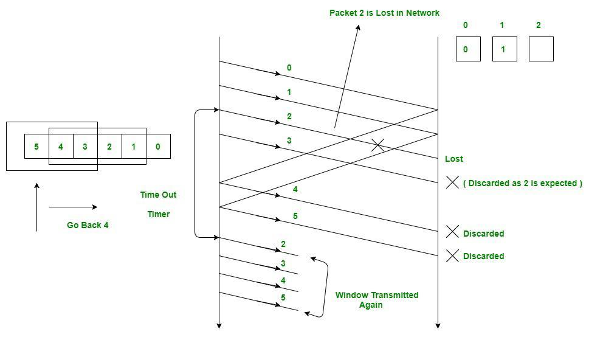

# **Go-Back-N ARQ (Automatic Repeat Request) | Data Link Layer**

**Go-Back-N ARQ** is an error-control protocol that allows the sender to send **multiple frames at once** without waiting for individual acknowledgments.

It is used to **improve efficiency** compared to Stop-and-Wait.

---

# ✅ **Key Idea**

Sender can send **up to N frames** before needing an acknowledgment.
If one frame is lost or damaged, the sender must **go back** and retransmit that frame **and all frames after it**.

Hence the name: **Go-Back-N**.

---

# ⭐ Components of Go-Back-N:

### **1️⃣ Sliding Window**

* Sender uses a **window of size N**.
* Receiver window size = **1** (Receiver accepts only the next expected frame).

### **2️⃣ Cumulative Acknowledgment**

Receiver sends an ACK that means:

> “I successfully received all frames up to number **k**.”

---

# 🎯 **How Go-Back-N Works (Step-by-Step)**

### **1. Sender sends multiple frames**

Example window size = 4
Sender can send: Frame 0, 1, 2, 3 → without waiting for ACK.

### **2. Receiver only accepts the next expected frame**

If it expects **Frame 0**, but receives Frame 1 → it **discards** it.

### **3. ACK is cumulative**

If receiver sends **ACK 3**, it means:

* Frame 0 received
* Frame 1 received
* Frame 2 received

And the next expected is **Frame 3**.

### **4. If a frame is lost**

Suppose **Frame 2** is lost.

* Receiver receives Frame 3 → but discards it (only expected Frame 2)
* Receiver keeps sending **ACK 2** (last correctly received)

Sender will **timeout**, and then:

### **5. Sender retransmits from the lost frame**

Sender will resend:

```
Frame 2, Frame 3, Frame 4 ... (all frames after the lost one)
```

This is why it is called **Go-Back-N**.

---

# 📘 Example Timeline

### Window size = 4

#### (1) A → sends: Frame 0, 1, 2, 3

#### (2) Frame 2 gets lost

#### (3) B receives Frame 3 → discards

#### (4) B sends ACK 2 repeatedly

#### (5) A times out

#### (6) A retransmits: Frame 2, 3

---

# ⚡ Advantages

* Much **faster** than Stop-and-Wait
* Efficient when network is reliable
* Reduces waiting time

---

# ⚠ Disadvantages

* If **one frame is lost**, many frames must be resent
* Wastes bandwidth if errors occur frequently

---

# 📝 Where it’s used

* Data Link Layer protocols (HDLC, PPP)
* Some Transport Layer protocols (older TCP variants)

---

# ✔ Final Summary (Exam Style)

**Go-Back-N ARQ** is a sliding-window-based error-control protocol in the data link layer where the sender can transmit **N unacknowledged frames** at once.
If a frame is lost or damaged, the sender **goes back** and retransmits that frame **and all subsequent frames**, using **cumulative ACKs** to maintain order.


---
---
---




# ✅ **Go-Back-N ARQ – Explanation of the Diagram**

We have:

* **Sender** (left)
* **Receiver** (right)
* **Window size = 4** (frames 0,1,2,3 can be sent before waiting)

Frames being sent: **0, 1, 2, 3, 4, 5**

---

# ⭐ **STEP 1 — Sender sends frames continuously**

### Sender sends:

```
Frame 0 → Receiver
Frame 1 → Receiver
Frame 2 → (lost in the network)
Frame 3 → Receiver
Frame 4 → Receiver
Frame 5 → Receiver
```

All frames go out **without waiting** because this is Go-Back-N.

---

# ⭐ **STEP 2 — Frame 2 is LOST**

This is shown by the **X** on the line labeled “Packet 2 is Lost in Network”.

Receiver behavior:

* Receiver expects **Frame 2**
* But it **never arrives**

---

# ⭐ **STEP 3 — Receiver gets Frame 3, 4, 5 but discards them**

Receiver only accepts **the next expected frame**.

Receiver expected = **2**

So:

* Frame **3** → discarded
  (because Frame 2 is missing)
* Frame **4** → discarded
* Frame **5** → discarded

Receiver **cannot move forward** until Frame 2 arrives.

---

# ⭐ **STEP 4 — Receiver keeps sending ACK 2**

Because Frame 2 is the last correctly received frame (0,1 received earlier):

Receiver keeps sending:

```
ACK 2
ACK 2
ACK 2
```

Meaning:

> “I am still waiting for Frame 2. Send it!”

---

# ⭐ **STEP 5 — Sender timeout occurs**

Sender did **not** receive ACK for frame 2.
Timer expires → **timeout**.

This is shown in the diagram where it says **Time Out**, **Timer**.

---

# ⭐ **STEP 6 — Sender goes back to frame 2**

That’s why the protocol is called:

# **✔ Go-Back-N → Go Back to Frame 2**

Sender retransmits **Frame 2 and all frames after it**:

```
Frame 2 → Receiver
Frame 3 → Receiver
Frame 4 → Receiver
Frame 5 → Receiver
```

Shown as “Window Transmitted Again” in the diagram.

---

# ⭐ **STEP 7 — Receiver now accepts all frames**

The retransmitted frames are now in order:

* Frame 2 (✔ accepted)
* Frame 3 (✔ accepted)
* Frame 4 (✔ accepted)
* Frame 5 (✔ accepted)

Receiver sends cumulative ACKs:

```
ACK 3 → means 0,1,2 received
ACK 4 → means 0,1,2,3 received
ACK 5 → means 0,1,2,3,4 received
ACK 6 → means 0,1,2,3,4,5 received
```

---

# 🎯 **Why frames were discarded earlier?**

Because Go-Back-N receiver **never buffers out-of-order frames**.

Receiver expects Frame 2
But receives Frame 3 → discards
Receives Frame 4 → discards
Receives Frame 5 → discards

Receiver waits until Frame 2 arrives.

---

# ⭐ FINAL SUMMARY (Very Easy to Remember)

| Event                                   | What Happens                        |
| --------------------------------------- | ----------------------------------- |
| Sender sends frames 0–5 without waiting | Allowed in Go-Back-N                |
| Frame 2 gets lost                       | Main problem                        |
| Receiver discards frames 3,4,5          | Because it expects 2                |
| Receiver keeps sending ACK 2            | “Send 2 again”                      |
| Sender timeout                          | No ACK for Frame 2                  |
| Sender retransmits 2,3,4,5              | Must resend all from the lost frame |
| Receiver accepts all frames             | All OK now                          |

This is exactly the behavior of **Go-Back-N ARQ**.

---
---
---

# ✅ **1. Why Window Size < 2ᵐ? (In Go-Back-N or Selective Repeat)**

Here:

* **m** = number of bits used for the **sequence number**
* Sequence numbers range from **0 to 2ᵐ − 1**

Example:
If **m = 3 bits**, sequence numbers = 0 to 7 → total **8 numbers**.

---

### ✔ Why can’t window size be equal to 2ᵐ?

Because then **frames will repeat sequence numbers while old frames are still in the network**.

This causes **ambiguity**:

Receiver cannot differentiate:

* **A new frame**
  AND
* **A retransmitted old frame**

---

### ⭐ The rule:

\[
\textbf{Window size must be < } 2^m
\]

This ensures that **old frame numbers expire BEFORE sequence numbers repeat**.

So receiver never gets confused.

---

### ✔ Simple Example

m = 3 → sequence numbers = 0 to 7.

If sender window = 8 frames
Sender might send:

```
0 1 2 3 4 5 6 7
```

Then sender wraps and sends again:

```
0 1 2 3 …
```

But what if the receiver **still has an old frame 0** from the first round?
It will confuse:

* Old frame 0 (from first round)
* New frame 0 (from second round)

❌ Receiver won’t know which 0 is new → error!

So to avoid this:

### **Maximum window size = (2ᵐ − 1)**

Never equal to 2ᵐ.

---

# ✅ **2. What is an Out-of-Order Packet?**

Very simple:

## **An out-of-order packet = a packet that arrives earlier or later than expected.**

Receiver expects packets in a specific sequence:

```
0, 1, 2, 3, 4…
```

But what if it gets:

```
0, 1, 3, 4, 2
```

Here:

* Packet **2** is missing
* Packets **3** and **4** arrived **out of order**

---

# ⭐ Out-of-order in Go-Back-N

Receiver **cannot accept out-of-order packets**.

If it expects frame **2** but receives **3**:

```
Receiver discards 3
Receiver discards 4
Receiver keeps sending ACK 2
```

Because it MUST receive them **in order**.

---

# ⭐ Out-of-order in Selective Repeat

Receiver **can buffer** out-of-order packets.

If frame 2 is lost:

```
Receiver buffers 3
Receiver buffers 4
Receiver buffers 5
```

Later, when frame 2 arrives, it reorders frames correctly.

---

# 🎯 Short Summary

### ✔ **Window size < 2ᵐ**

To avoid sequence number overlap and confusion between old and new frames.

### ✔ **Out-of-order packet**

A frame that arrives **not in the expected order**.

* Go-Back-N → **discard out-of-order**
* Selective Repeat → **buffer out-of-order**
