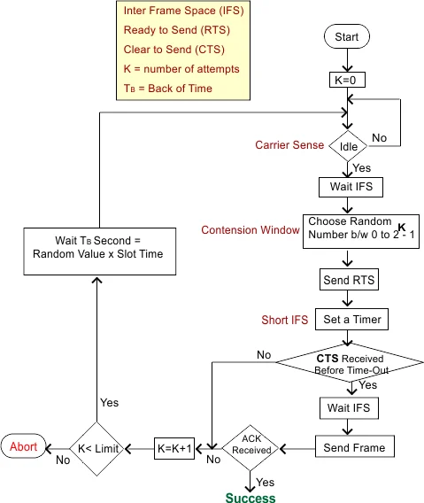

# 🌐 What is CSMA/CA? (One-line idea)

> **CSMA/CA is a network access method used in wireless networks where devices try to avoid collisions before sending data.**

Short version:

> **Listen → Wait → Avoid collision → Send → Confirm**

---

## 🧠 Why CSMA/CA is needed (Very Important)

In **wireless networks (Wi-Fi)**:

* Devices **cannot listen while transmitting**
* Collisions **cannot be detected**
* Signal strength varies
* Hidden node problem exists

👉 So **CSMA/CD does NOT work in wireless networks**.

That’s why **CSMA/CA** was introduced.

---

## 🧩 Breaking the Name

### 1️⃣ Carrier

* The **wireless medium (air)**

---

### 2️⃣ Sense

* Device listens to check if the channel is busy

---

### 3️⃣ Multiple Access

* Many devices share the same wireless channel

---

### 4️⃣ Collision Avoidance

* Instead of detecting collisions,
* The protocol tries to **avoid them before transmission**

---

## 🪜 How CSMA/CA Works (Step by Step)

Assume **Station A** wants to send data.

---

### Step 1️⃣: Carrier Sensing

* A listens to the channel
* If busy → wait
* If free → continue

---

### Step 2️⃣: Inter-Frame Space (IFS)

* A waits for a **short fixed time**
* Ensures previous transmission has fully ended

---

### Step 3️⃣: Random Backoff

* A chooses a **random backoff time**
* Countdown decreases **only when channel is idle**
* If channel becomes busy → freeze countdown

👉 This reduces chance of two stations transmitting together.

---

### Step 4️⃣: Transmission

* When backoff reaches zero → A transmits data

---

### Step 5️⃣: Acknowledgement (ACK)

* Receiver sends **ACK**
* If ACK received → transmission successful
* If ACK not received → assume collision → retransmit

---

## 🔁 Optional RTS/CTS Mechanism (Very Important)

Used to handle the **Hidden Node Problem**.

---

### Hidden Node Problem

* A and C cannot hear each other
* Both send to B
* Collision occurs at B

---

### RTS/CTS Solution

1. Sender sends **RTS (Request To Send)**
2. Receiver replies **CTS (Clear To Send)**
3. All nearby stations hear CTS and stay silent
4. Sender transmits data safely

---

## 🧠 Why CSMA/CA uses ACK but CSMA/CD does not

| CSMA/CD           | CSMA/CA                 |
| ----------------- | ----------------------- |
| Detects collision | Cannot detect collision |
| No ACK            | Uses ACK                |
| Wired Ethernet    | Wireless Wi-Fi          |

---

## ⚠️ What happens if ACK is not received?

* Sender assumes collision or interference
* Increases contention window
* Chooses new random backoff
* Retries transmission

---

## 📍 Where CSMA/CA is used

✔ Wi-Fi (IEEE 802.11)
✔ Wireless LANs

❌ Wired Ethernet

---

## ✅ Advantages of CSMA/CA

✔ Avoids most collisions
✔ Suitable for wireless networks
✔ Efficient under moderate load

---

## ❌ Disadvantages of CSMA/CA

❌ Overhead due to RTS/CTS and ACK
❌ Still cannot completely eliminate collisions
❌ Lower throughput than wired Ethernet

---

## 🔑 Key Differences: CSMA/CD vs CSMA/CA

| Feature            | CSMA/CD      | CSMA/CA      |
| ------------------ | ------------ | ------------ |
| Network type       | Wired        | Wireless     |
| Collision handling | Detect after | Avoid before |
| ACK used           | ❌ No         | ✔ Yes        |
| RTS/CTS            | ❌ No         | ✔ Yes        |
| Efficiency         | Higher       | Lower        |

---

## 📝 Exam-Ready One Paragraph Answer

> **CSMA/CA (Carrier Sense Multiple Access with Collision Avoidance)** is a medium access control protocol used in wireless networks. A station senses the channel before transmission and waits for a random backoff period to reduce collision probability. Since collisions cannot be detected in wireless communication, acknowledgements are used to confirm successful transmission. RTS/CTS mechanism is optionally used to handle the hidden node problem. CSMA/CA improves reliability in wireless networks by avoiding collisions rather than detecting them.

---

## 🧠 Easy Memory Trick

> **Wireless = Avoid collisions → CSMA/CA**
> **Wired = Detect collisions → CSMA/CD**

---
---
---
---

# 🧠 Before we start: Meanings of symbols in the picture

* **IFS (Inter-Frame Space)** → small fixed waiting time
* **RTS (Ready / Request To Send)** → “Can I send data?”
* **CTS (Clear To Send)** → “Yes, you can send”
* **K** → number of transmission attempts
* **TB (Backoff Time)** → random waiting time
* **Slot time** → smallest time unit in Wi-Fi

---

# 🔁 Step-by-Step Explanation of the Flowchart

---

## 🔹 Step 1: Start → `K = 0`

* The station (computer / phone) wants to send data
* `K = 0` means:

  > No attempts have been made yet

---

## 🔹 Step 2: Carrier Sense → “Is channel idle?”

The device **listens to the wireless channel**.

### If channel is **busy**

* ❌ Do nothing
* Keep listening

### If channel is **idle**

* ✅ Go to next step

👉 This is the **Carrier Sense** part.

---

## 🔹 Step 3: Wait IFS (Inter-Frame Space)

Even if channel is idle:

* The device **waits for a short fixed time (IFS)**

### Why?

* To ensure previous transmission is completely finished
* To give priority to control frames (ACK, CTS)

---

## 🔹 Step 4: Choose Random Number between `0` and `2^K − 1`

This is the **Contention Window** step.

* Device picks a **random number**
* This number decides how long it will wait

👉 This avoids multiple devices sending together.

---

## 🔹 Step 5: Wait TB (Backoff Time)

[
T_B = \text{Random value} \times \text{Slot Time}
]

What happens here:

* Countdown starts
* Countdown **decreases only when channel is idle**
* If channel becomes busy → countdown freezes

---

## 🔹 Step 6: Send RTS (Request To Send)

When backoff reaches **zero**:

* Device sends **RTS frame**

RTS message means:

> “I want to send data. Is it okay?”

---

## 🔹 Step 7: Set a Timer + Wait Short IFS

* Device waits for **CTS**
* Timer is started (timeout protection)
* Short IFS is used (higher priority)

---

## 🔹 Step 8: CTS received before timeout?

### ✅ YES (CTS received)

* Receiver allows transmission
* Other devices hearing CTS stay silent
* Go to next step

### ❌ NO (CTS not received)

* Collision or interference assumed
* Increase attempt counter:
  [
  K = K + 1
  ]
* Go to retry logic

---

## 🔹 Step 9: Wait IFS → Send Frame (DATA)

If CTS is received:

1. Wait IFS
2. Send **actual data frame**

---

## 🔹 Step 10: ACK received?

After sending data:

* Sender waits for **ACK**

### ✅ YES (ACK received)

* Transmission successful 🎉
* **SUCCESS**

### ❌ NO (ACK not received)

* Assume collision or error
* Increase attempts:
  [
  K = K + 1
  ]
* Retry

---

## 🔹 Step 11: Is `K < Limit`?

* Wi-Fi allows **limited retries**
* If `K < limit`:

  * Try again (go to backoff step)
* If `K ≥ limit`:

  * ❌ Abort transmission

---

# 🧠 What this flowchart is REALLY doing

This flowchart ensures:

✔ No two devices transmit together
✔ Collisions are **avoided**, not detected
✔ Hidden node problem is handled
✔ Reliability using ACK

---

# 🔁 One-Line Flow Summary (Easy to Remember)

> **Listen → Wait IFS → Random Backoff → RTS → CTS → Send Data → ACK → Success**

---

# 🧠 Key Differences You Should Notice

| Thing              | CSMA/CD        | CSMA/CA |
| ------------------ | -------------- | ------- |
| Collision handling | Detect         | Avoid   |
| ACK                | ❌ No           | ✔ Yes   |
| RTS/CTS            | ❌ No           | ✔ Yes   |
| Used in            | Wired Ethernet | Wi-Fi   |

---

# 📝 Exam-Ready Short Answer

> In CSMA/CA, a station senses the channel and waits for an inter-frame space. It then selects a random backoff time to reduce collision probability. The station sends an RTS frame and waits for CTS. If CTS and ACK are received, the transmission is successful. Otherwise, the station retries until the attempt limit is reached.
