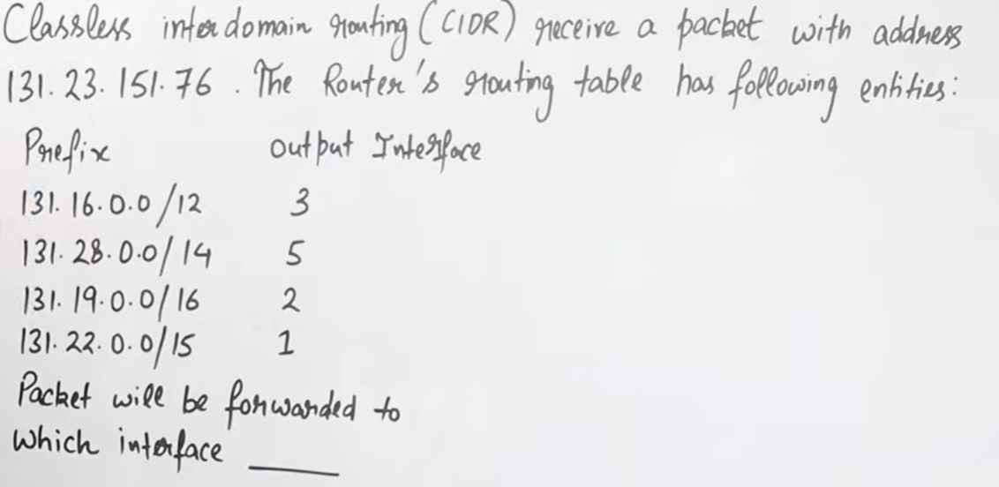

## 1️⃣ What is this question REALLY saying?

Let’s rewrite the question in **plain English**:

> A router receives a packet whose **destination IP address** is
> **131.23.151.76**
>
> The router has a **routing table** with multiple CIDR entries (prefixes).
>
> Each prefix tells the router:
>
> * “If the destination IP belongs to this network, send the packet through this interface.”
>
> The router must decide **which interface** to use.

👉 **Your job**:
Find **which routing-table entry best matches the destination IP**, and output **that interface number**.

---

## 2️⃣ The MOST IMPORTANT RULE (this is the heart of the problem)

### 🔑 CIDR Routing Rule (EXAM GOLD)

> **The router chooses the route with the LONGEST matching prefix.**

This is called **Longest Prefix Match (LPM)**.

⚠️ Not:

* first match
* smallest network
* class-based match

✅ ONLY:

> **The most specific (largest /number) prefix that matches**

---

## 3️⃣ Given Information (cleaned)

### 📦 Destination IP

```
131.23.151.76
```

---

### 📘 Routing Table

| Prefix         | Interface |
| -------------- | --------- |
| 131.16.0.0 /12 | 3         |
| 131.28.0.0 /14 | 5         |
| 131.19.0.0 /16 | 2         |
| 131.22.0.0 /15 | 1         |

---

## 4️⃣ Step-by-step: Check which prefixes MATCH the destination IP

We will **check one route at a time**
and ask a simple question:

> “Does 131.23.151.76 belong to this network?”

---

### ✅ Route 1: `131.16.0.0 /12`

#### What does `/12` mean?

* First **12 bits** must match
* `/12` covers a **very large range**

Range of `131.16.0.0/12`:

```
131.16.0.0  –  131.31.255.255
```

📍 Our IP:

```
131.23.151.76
```

✔ 23 is between 16 and 31
✔ MATCHES

➡️ Candidate interface = **3**

---

### ✅ Route 2: `131.28.0.0 /14`

Range of `/14`:

```
131.28.0.0 – 131.31.255.255
```

📍 Our IP second octet = **23**

❌ 23 is NOT between 28 and 31
❌ DOES NOT MATCH

➡️ Ignore this route

---

### ✅ Route 3: `131.19.0.0 /16`

Range of `/16`:

```
131.19.0.0 – 131.19.255.255
```

📍 Our IP second octet = **23**

❌ 23 ≠ 19
❌ DOES NOT MATCH

➡️ Ignore this route

---

### ✅ Route 4: `131.22.0.0 /15`

Range of `/15`:

```
131.22.0.0 – 131.23.255.255
```

📍 Our IP:

```
131.23.151.76
```

✔ 23 is inside the range
✔ MATCHES

➡️ Candidate interface = **1**

---

## 5️⃣ Now apply the MOST IMPORTANT RULE again

### Which routes matched?

| Prefix | Interface |
| ------ | --------- |
| /12    | 3         |
| /15    | 1         |

Both match ❗
So what now?

👉 **Choose the LONGEST prefix**

| Prefix | Length       |
| ------ | ------------ |
| /12    | shorter      |
| /15    | **longer ✅** |

---

## 6️⃣ ✅ FINAL ANSWER

### ✔ The packet will be forwarded to:

```
Interface 1
```

---

## 7️⃣ Why this question is IMPORTANT for exams

Because it tests:

* CIDR understanding
* Longest Prefix Match
* Routing logic (not subnetting math)

---

## 8️⃣ One-line exam answer (write this if short answer asked)

> The packet is forwarded to **interface 1** because prefix `131.22.0.0/15` is the longest matching prefix for destination IP `131.23.151.76`.

---
---
---
---
---
---
---
---
---
---
---
---
---
---


# 🔥 CIDR Routing MCQs (Longest Prefix Match)

---

## 🟢 MCQ 1 (Easy – Warm-up)

A router receives a packet destined to **10.1.5.7**.
Routing table:

| Prefix      | Interface |
| ----------- | --------- |
| 10.0.0.0/8  | A         |
| 10.1.0.0/16 | B         |
| 10.1.5.0/24 | C         |

Where will the packet be forwarded?

### Options:

A) A
B) B
C) C
D) Dropped

### ✅ Answer:

**C**

### 🧠 Explanation:

All three match, but:

```
/24 > /16 > /8
```

➡️ Longest prefix = `/24` → Interface **C**

---

## 🟢 MCQ 2 (Classic Exam Question)

Destination IP: **192.168.1.130**

Routing table:

| Prefix           | Interface |
| ---------------- | --------- |
| 192.168.0.0/16   | 1         |
| 192.168.1.0/24   | 2         |
| 192.168.1.128/25 | 3         |

Packet goes to?

### Options:

A) 1
B) 2
C) 3
D) None

### ✅ Answer:

**C**

### 🧠 Explanation:

* 130 belongs to all three
* Longest prefix = `/25`
  ➡️ Interface **3**

---

## 🟡 MCQ 3 (Medium – Careful)

Destination IP: **172.16.10.5**

Routing table:

| Prefix         | Interface |
| -------------- | --------- |
| 172.16.0.0/12  | A         |
| 172.16.8.0/21  | B         |
| 172.16.10.0/23 | C         |

Where is packet forwarded?

### Options:

A) A
B) B
C) C
D) Dropped

### ✅ Answer:

**C**

### 🧠 Explanation:

* All match
* Prefix lengths:

```
/12 < /21 < /23
```

➡️ Longest match = `/23` → **C**

---

## 🟡 MCQ 4 (Tricky Range Check)

Destination IP: **131.45.200.10**

Routing table:

| Prefix          | Interface |
| --------------- | --------- |
| 131.0.0.0/8     | 1         |
| 131.45.0.0/16   | 2         |
| 131.45.192.0/18 | 3         |

Correct interface?

### Options:

A) 1
B) 2
C) 3
D) Dropped

### ✅ Answer:

**C**

### 🧠 Explanation:

* 200 ∈ 192–255 → matches `/18`
* `/18` is longest

---

## 🔴 MCQ 5 (Very Important – GATE Style)

Destination IP: **200.10.50.25**

Routing table:

| Prefix         | Interface |
| -------------- | --------- |
| 200.10.0.0/16  | P         |
| 200.10.32.0/19 | Q         |
| 200.10.48.0/20 | R         |

Where does packet go?

### Options:

A) P
B) Q
C) R
D) Dropped

### ✅ Answer:

**C**

### 🧠 Explanation:

* 50 ∈ 48–63 → `/20`
* `/20` is longest prefix

---

## 🔴 MCQ 6 (Check Non-Matching Case)

Destination IP: **192.168.5.10**

Routing table:

| Prefix         | Interface |
| -------------- | --------- |
| 192.168.0.0/24 | A         |
| 192.168.1.0/24 | B         |

Packet forwarded to?

### Options:

A) A
B) B
C) Dropped
D) Both

### ✅ Answer:

**C**

### 🧠 Explanation:

* 5 ≠ 0 or 1
* No prefix matches → **Dropped**

---

## 🔴 MCQ 7 (Multiple Matches, Same Length)

Destination IP: **10.10.1.5**

Routing table:

| Prefix       | Interface |
| ------------ | --------- |
| 10.10.0.0/16 | A         |
| 10.10.1.0/16 | B         |

Correct action?

### Options:

A) A
B) B
C) Random
D) Routing error

### ✅ Answer:

**D**

### 🧠 Explanation:

* Same prefix length
* Overlapping prefixes of equal length
* ❌ Ambiguous → **Routing error**

---

## 🔴 MCQ 8 (Default Route Case)

Destination IP: **8.8.8.8**

Routing table:

| Prefix         | Interface |
| -------------- | --------- |
| 10.0.0.0/8     | A         |
| 192.168.0.0/16 | B         |
| 0.0.0.0/0      | C         |

Packet goes to?

### Options:

A) A
B) B
C) C
D) Dropped

### ✅ Answer:

**C**

### 🧠 Explanation:

* No specific match
* Default route `/0` always matches

---

## 🧠 EXAM SHORT RULE (REMEMBER THIS)

> **CIDR routing always selects the route with the longest matching prefix.**

---

## 🔥 10-Second Exam Strategy

1️⃣ Find **all matching prefixes**
2️⃣ Pick **largest /number**
3️⃣ Done ✔

---


---
---
---
---
---
---
---
---
---
---
---
---
---

Below are **VERY IMPORTANT CIDR NUMERICAL QUESTIONS**, solved **step-by-step**, exactly the type asked in:

* ✅ **GATE**
* ✅ **NET**
* ✅ **University exams**
* ✅ **Placement tests**
* ✅ **Viva**


# 🔥 Numerical Questions on CIDR (Classless Addressing)

---

## 🔴 QUESTION 1 (Most Basic but VERY IMPORTANT)

### Given:

```
192.168.1.0/26
```

### Find:

1️⃣ Number of subnets
2️⃣ Hosts per subnet
3️⃣ Network ID
4️⃣ Broadcast address

---

### ✅ Solution

**Prefix = /26**

#### Step 1️⃣ Host bits

```
32 − 26 = 6
```

#### Step 2️⃣ Hosts per subnet

```
2^6 − 2 = 62
```

#### Step 3️⃣ Subnet mask

```
/26 = 255.255.255.192
```

#### Step 4️⃣ Block size

```
256 − 192 = 64
```

#### Step 5️⃣ Subnets

```
0–63
64–127
128–191
192–255
```

✔️ **Answer**

* Network ID (1st): `192.168.1.0`
* Broadcast: `192.168.1.63`

---

## 🔴 QUESTION 2 (Find Network & Broadcast – Very Common)

### Given IP:

```
192.168.10.77/27
```

---

### ✅ Solution

#### Step 1️⃣ Subnet mask

```
/27 = 255.255.255.224
```

#### Step 2️⃣ Block size

```
256 − 224 = 32
```

#### Step 3️⃣ Ranges

```
0–31
32–63
64–95  ← 77 lies here
```

✔️ **Answer**

| Field      | Value         |
| ---------- | ------------- |
| Network ID | 192.168.10.64 |
| First Host | 192.168.10.65 |
| Last Host  | 192.168.10.94 |
| Broadcast  | 192.168.10.95 |

---

## 🔴 QUESTION 3 (Hosts Required – CIDR)

### Given:

```
Network: 10.0.0.0
Requirement: At least 500 hosts per subnet
```

---

### ✅ Solution

#### Step 1️⃣ Find host bits

```
2^h − 2 ≥ 500
```

```
2^9 − 2 = 510 ✅
```

So:

```
Host bits = 9
```

#### Step 2️⃣ Prefix length

```
32 − 9 = /23
```

✔️ **Answer**

```
CIDR block = /23
Subnet mask = 255.255.254.0
Hosts = 510
```

---

## 🔴 QUESTION 4 (Number of Subnets – Competitive Favorite)

### Given:

```
172.16.0.0/20
```

---

### ✅ Solution

#### Step 1️⃣ Host bits

```
32 − 20 = 12
```

#### Step 2️⃣ Hosts per subnet

```
2^12 − 2 = 4094
```

#### Step 3️⃣ Subnets inside Class B

Default Class B = `/16`

Borrowed bits:

```
20 − 16 = 4
```

Subnets:

```
2^4 = 16
```

✔️ **Answer**

* Subnets = **16**
* Hosts per subnet = **4094**

---

## 🔴 QUESTION 5 (CIDR + Aggregation – VERY IMPORTANT)

### Given routes:

```
192.168.4.0/24
192.168.5.0/24
192.168.6.0/24
192.168.7.0/24
```

### Find the **single aggregated CIDR block**

---

### ✅ Solution

Number of networks:

```
4 = 2^2
```

So reduce prefix by 2:

```
/24 − 2 = /22
```

✔️ **Answer**

```
192.168.4.0/22
```

---

## 🔴 QUESTION 6 (Find CIDR for Given IP Range)

### Given range:

```
192.168.1.64 – 192.168.1.127
```

---

### ✅ Solution

Total addresses:

```
127 − 64 + 1 = 64
```

```
64 = 2^6
```

Prefix:

```
32 − 6 = /26
```

✔️ **Answer**

```
192.168.1.64/26
```

---

## 🔴 QUESTION 7 (Tricky – Given IP must belong to subnet)

### Given:

```
Network: 192.168.50.0
CIDR: /27
Find subnet containing IP 192.168.50.90
```

---

### ✅ Solution

Block size:

```
256 − 224 = 32
```

Ranges:

```
0–31
32–63
64–95  ← 90 lies here
```

✔️ **Answer**

```
Network ID: 192.168.50.64
Broadcast: 192.168.50.95
```

---

## 🔴 QUESTION 8 (Maximum Hosts – Direct Formula)

### Given:

```
CIDR block: /19
```

---

### ✅ Solution

Host bits:

```
32 − 19 = 13
```

Hosts:

```
2^13 − 2 = 8190
```

✔️ **Answer**

```
8190 hosts
```

---

## 🧠 SUPER FAST CIDR TRICKS (EXAM GOLD ⭐)

### 🔹 Trick 1: Hosts from Prefix

```
Hosts = 2^(32 − prefix) − 2
```

### 🔹 Trick 2: Prefix from Hosts

```
Prefix = 32 − log₂(hosts + 2)
```

### 🔹 Trick 3: Aggregation

```
Number of networks = 2^n
New prefix = old prefix − n
```

---

## 📝 ONE-LINE EXAM ANSWERS

**Q:** Why CIDR is used?
**A:** To reduce IP wastage and routing table size.

**Q:** CIDR notation?
**A:** IP address followed by prefix length (e.g., /26).

**Q:** CIDR supports?
**A:** VLSM and route aggregation.

---

## 🔚 FINAL TAKEAWAY

✔ Same math as subnetting
✔ No class restriction
✔ Real-world routing uses CIDR
✔ Competitive exams LOVE CIDR numericals
