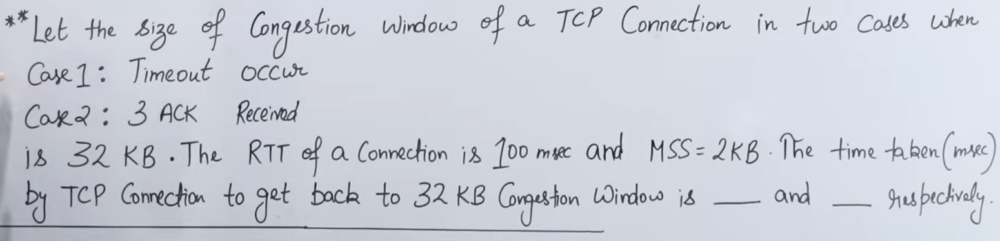

# 🚦 TCP CONGESTION CONTROL

**(Transport Layer | Computer Networks)**

---

## ❓ What is Congestion?

**Congestion** happens when:

* Too many packets are sent into the network
* Routers’ buffers overflow
* Packets get **delayed or dropped**

📌 Think of it as a **traffic jam in the network**.

---

## ❓ Why TCP needs Congestion Control

Without congestion control:

* Packet loss increases
* Retransmissions increase
* Network collapses (congestion collapse)

👉 **TCP controls how fast data is injected into the network** to avoid overload.

---

## 🔑 Important Concept (VERY IMPORTANT)

### Flow Control vs Congestion Control

| Flow Control         | Congestion Control     |
| -------------------- | ---------------------- |
| Protects receiver    | Protects network       |
| Receiver capacity    | Network capacity       |
| Uses receiver window | Uses congestion window |

📌 **TCP does both**, but they are different.

---

# 🧠 Key Idea Behind TCP Congestion Control

TCP assumes:

> **Packet loss = network congestion**

So when loss occurs:

* TCP **reduces sending rate**
* When network is fine:
* TCP **slowly increases sending rate**

---

## 🔢 Key Terms (Must Know)

### 1️⃣ Congestion Window (cwnd)

* Limits how much data TCP can send
* Controlled by TCP (sender side)

### 2️⃣ Receiver Window (rwnd)

* Advertised by receiver

### ✅ Actual sending window:

```
Sending Window = min(cwnd, rwnd)
```

---

# 🚀 TCP CONGESTION CONTROL ALGORITHMS

TCP uses **4 main mechanisms**:

1. Slow Start
2. Congestion Avoidance
3. Fast Retransmit
4. Fast Recovery

We’ll explain **each with logic + real-life analogy**.

---

# 1️⃣ Slow Start

❗ Name is confusing — it is actually **fast growth at the beginning**.

---

## 🔹 Why Slow Start is needed

At the start:

* TCP does **not know** network capacity
* So it starts **carefully**

---

## 🔹 How Slow Start works

* Initial `cwnd = 1 MSS`
* For every ACK received:

  * `cwnd` **doubles every RTT**

### Example:

| RTT   | cwnd |
| ----- | ---- |
| Start | 1    |
| 1     | 2    |
| 2     | 4    |
| 3     | 8    |
| 4     | 16   |

📌 This is **exponential growth**.

---

## 🔹 When Slow Start stops

When:

* `cwnd` reaches **ssthresh** (slow start threshold)
* OR packet loss occurs

---

## 🧠 Real-life example

Opening a new highway:

* Start with few cars
* If traffic flows well → allow more cars quickly

---

## ✍️ Exam line

> **Slow Start increases the congestion window exponentially until congestion is detected or a threshold is reached.**

---

# 2️⃣ Congestion Avoidance

---

## 🔹 Why Congestion Avoidance

After reaching safe speed:

* Increasing too fast may cause congestion
* So TCP becomes **careful**

---

## 🔹 How it works

* `cwnd` increases **linearly**
* Roughly **+1 MSS per RTT**

📌 Much slower than slow start.

---

## 🧠 Real-life example

Traffic already flowing smoothly:

* Add cars **slowly**
* Avoid traffic jam

---

## ✍️ Exam line

> **Congestion avoidance increases the congestion window linearly to prevent congestion.**

---

# 3️⃣ Fast Retransmit

---

## 🔹 Problem it solves

Normally:

* TCP waits for timeout to detect loss
* Timeout is slow

---

## 🔹 How Fast Retransmit works

If sender receives:

* **3 duplicate ACKs**

Then TCP assumes:

> Packet is lost

➡️ Retransmit **immediately**, without waiting for timeout.

---

## 🧠 Real-life example

Courier service:

* Receiver says 3 times:

  > “Package #5 missing”
* Sender resends immediately

---

## ✍️ Exam line

> **Fast retransmit resends a lost segment upon receiving three duplicate acknowledgements.**

---

# 4️⃣ Fast Recovery

---

## 🔹 Why Fast Recovery is needed

After loss:

* Network is congested
* But **not totally broken**

So:

* Do not go back to slow start completely

---

## 🔹 How Fast Recovery works

When loss detected via duplicate ACKs:

1. `ssthresh = cwnd / 2`
2. `cwnd = ssthresh`
3. Continue with **congestion avoidance**

📌 Faster recovery than restarting from scratch.

---

## 🧠 Real-life example

Traffic jam clears:

* Don’t stop all cars
* Resume at controlled speed

---

## ✍️ Exam line

> **Fast recovery reduces the congestion window and continues transmission using congestion avoidance instead of slow start.**

---

# 🔁 What happens on Timeout vs Duplicate ACK?

| Event            | TCP Reaction                    |
| ---------------- | ------------------------------- |
| Timeout          | cwnd → 1 (Slow Start again)     |
| 3 Duplicate ACKs | Fast Retransmit + Fast Recovery |

📌 Timeout = severe congestion
📌 Duplicate ACKs = mild congestion

---

# 🧠 COMPLETE FLOW (VERY IMPORTANT)

1. Start → **Slow Start**
2. Reach threshold → **Congestion Avoidance**
3. Packet loss →

   * Duplicate ACKs → Fast Retransmit + Fast Recovery
   * Timeout → Slow Start

---

# 🏁 Real-Life Summary Example (Traffic System)

| TCP Concept          | Traffic Analogy        |
| -------------------- | ---------------------- |
| cwnd                 | Number of cars allowed |
| Slow Start           | Opening road carefully |
| Congestion Avoidance | Controlled traffic     |
| Packet loss          | Accident               |
| Fast Retransmit      | Emergency reroute      |
| Fast Recovery        | Gradual traffic resume |

---

# ✍️ Perfect Exam Definition

> **TCP congestion control is a mechanism that regulates the rate of data transmission to prevent network overload using algorithms such as slow start, congestion avoidance, fast retransmit, and fast recovery.**

---

# 🧠 One-Line Memory Trick

> **TCP probes the network: increase when safe, decrease when congestion appears.**


---
---
---
---




# 📘 Given Problem (Rewrite Clearly)

* Current **Congestion Window (cwnd)** = **32 KB**
* **RTT** = **100 ms**
* **MSS** = **2 KB**

Find **time taken (in ms)** to get back to **32 KB cwnd** in two cases:

1. **Case 1:** Timeout occurs
2. **Case 2:** 3 duplicate ACKs received

---

# 🧠 First: Convert everything to MSS units

(THIS STEP IS VERY IMPORTANT)

TCP congestion algorithms work in **MSS**, not KB.

[
\text{cwnd (in MSS)} = \frac{32 \text{ KB}}{2 \text{ KB}} = 16 \text{ MSS}
]

So:

* Initial cwnd = **16 MSS**

---

# 🔴 CASE 1: TIMEOUT OCCURS

### What TCP does on **timeout**

When a timeout occurs:

1. `ssthresh = cwnd / 2`
2. `cwnd = 1 MSS`
3. TCP enters **Slow Start**

---

## Step 1: New Threshold

[
ssthresh = \frac{16}{2} = 8 \text{ MSS}
]

---

## Step 2: Slow Start (Exponential Growth)

In slow start:

* cwnd **doubles every RTT**

| RTT   | cwnd (MSS) |
| ----- | ---------- |
| Start | 1          |
| 1     | 2          |
| 2     | 4          |
| 3     | 8          |

📌 Slow start stops at **ssthresh = 8 MSS**

⏱️ Time so far:
[
3 \times RTT = 3 \times 100 = 300 \text{ ms}
]

---

## Step 3: Congestion Avoidance (Linear Growth)

From now on:

* cwnd increases by **1 MSS per RTT**

We need to go from:
[
8 \rightarrow 16 \text{ MSS}
]

Increase needed:
[
16 - 8 = 8 \text{ MSS}
]

Time needed:
[
8 \times RTT = 8 \times 100 = 800 \text{ ms}
]

---

## ✅ Total Time (Case 1)

[
300 + 800 = \boxed{1100 \text{ ms}}
]

---

# 🟢 CASE 2: 3 DUPLICATE ACKs RECEIVED

### What TCP does on **3 duplicate ACKs**

This is **Fast Retransmit + Fast Recovery**:

1. `ssthresh = cwnd / 2`
2. `cwnd = ssthresh`
3. TCP directly enters **Congestion Avoidance**
4. **NO slow start**

---

## Step 1: New Threshold

[
ssthresh = \frac{16}{2} = 8 \text{ MSS}
]

Now:
[
cwnd = 8 \text{ MSS}
]

---

## Step 2: Congestion Avoidance (Linear Growth)

We need:
[
8 \rightarrow 16 \text{ MSS}
]

Increase needed:
[
16 - 8 = 8 \text{ MSS}
]

Each RTT increases cwnd by **1 MSS**:

[
8 \times RTT = 8 \times 100 = 800 \text{ ms}
]

---

## ✅ Total Time (Case 2)

[
\boxed{800 \text{ ms}}
]

---

# 🧾 FINAL ANSWER (WRITE THIS)

> The time taken by TCP to return to a congestion window of **32 KB** is:
>
> * **1100 ms** when a **timeout occurs**
> * **800 ms** when **3 duplicate ACKs are received**

---

# 🧠 WHY TIMEOUT TAKES MORE TIME (Conceptual)

| Event      | Reason                                 |
| ---------- | -------------------------------------- |
| Timeout    | Severe congestion → restart from 1 MSS |
| 3 dup ACKs | Mild congestion → no slow start        |

---

# 🧠 One-Line Memory Trick (Exam Gold)

> **Timeout → Slow Start + Congestion Avoidance
> 3 duplicate ACKs → Only Congestion Avoidance**
